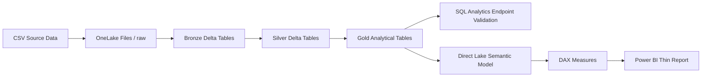
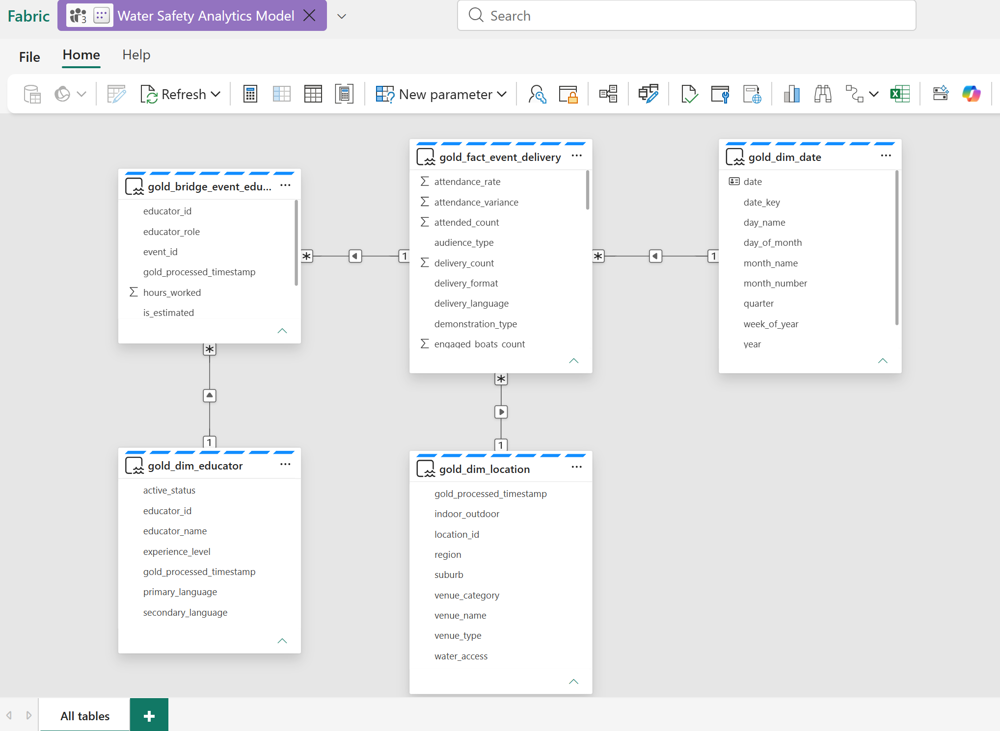
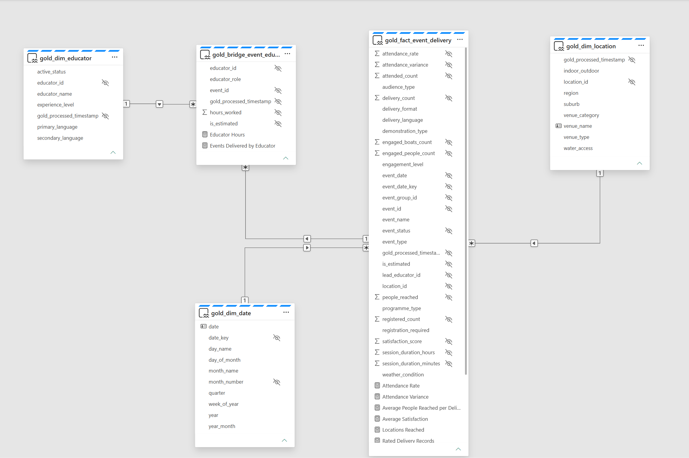
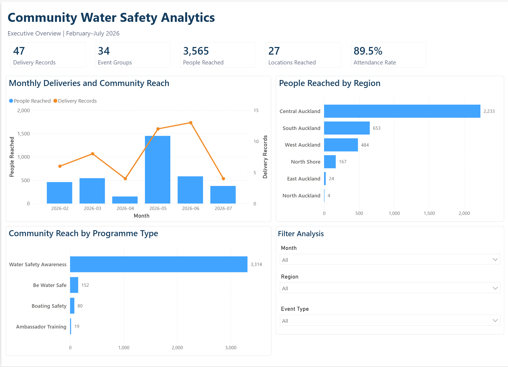
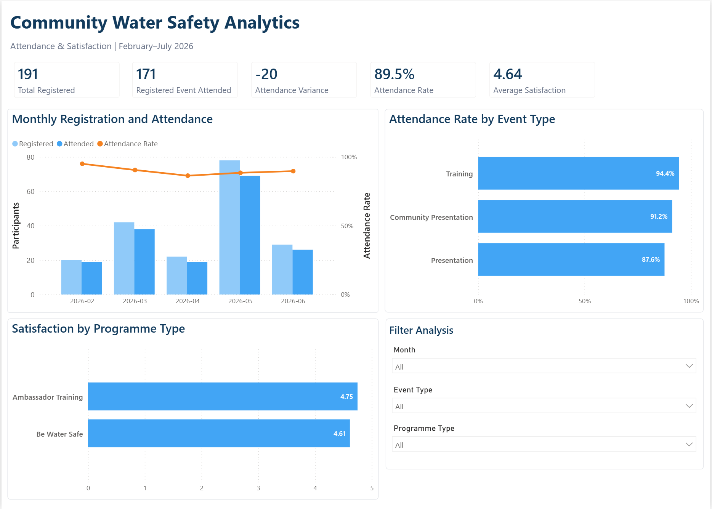
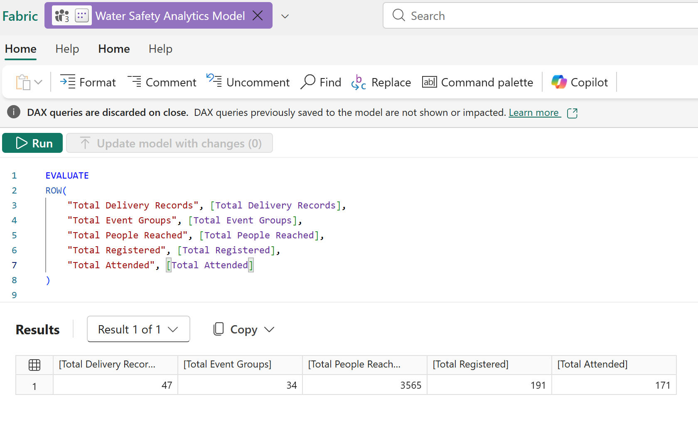
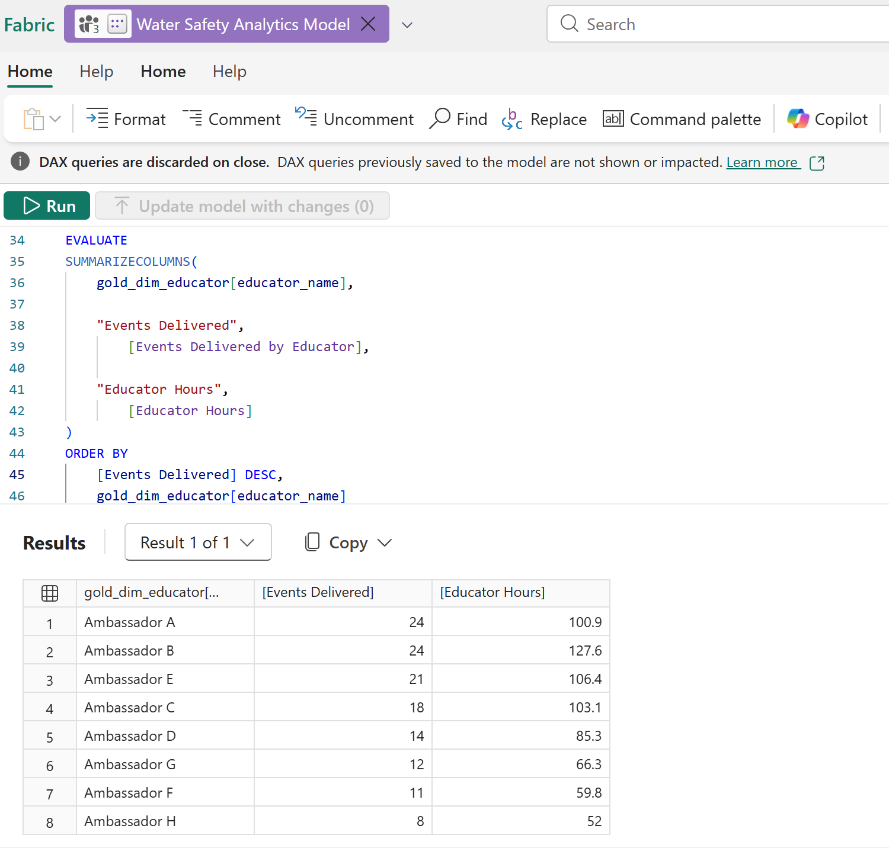

# Community Water Safety Analytics with Microsoft Fabric

## Project Overview

This portfolio project demonstrates the development of an end-to-end community outreach analytics solution using Microsoft Fabric.

The project uses synthetic and anonymised community water-safety activity data to analyse programme delivery, participant reach, registration and attendance, regional coverage, language accessibility, venue usage, satisfaction, and educator contribution.

The solution follows a Medallion Architecture:

- raw CSV files are stored in OneLake;
- PySpark notebooks ingest the source data into Bronze Delta tables;
- the Silver layer cleans, standardises, types, deduplicates, and validates the data;
- the Gold layer creates an analytics-ready dimensional model;
- the SQL analytics endpoint validates the Gold model against twelve business questions;
- a Direct Lake semantic model provides relationships, business definitions, and reusable DAX measures for Power BI.

The current implementation includes:

- Microsoft Fabric Workspace and Lakehouse
- OneLake file storage
- Bronze, Silver, and Gold Delta tables
- Fabric notebooks using Python and PySpark
- Data quality and referential-integrity checks
- SQL analytics endpoint validation
- A Direct Lake semantic model
- A fact/dimension model with an event-educator bridge table
- 15 reusable DAX measures organised into display folders
- A report-ready presentation layer with technical fields hidden
- DAX validation queries
- A two-page interactive Power BI thin report
- Executive Overview and Attendance & Satisfaction report pages
- Interactive slicers and cross-filtering
- Technical documentation and validation screenshots

The current reporting phase includes two completed Power BI pages built as a thin report on top of the Direct Lake semantic model.

> **Data disclaimer:** All data used in this project is synthetic and anonymised for learning and portfolio purposes. It does not contain confidential, personal, or official organisational performance information.

## Solution Architecture



## Repository Structure

```text
fabric-water-safety-analytics/
├── data/                         Synthetic and anonymised CSV source data
├── notebooks/                    Bronze, Silver, and Gold Fabric notebooks
├── sql/                          Gold-layer SQL validation queries
├── dax/                          DAX measure definitions and validation queries
├── docs/                         Architecture and semantic-model documentation
├── screenshots/                  Fabric model and validation evidence
└── README.md
```

## Fabric Notebooks

### 01 - Bronze Data Ingestion

[`01_load_bronze_data.ipynb`](notebooks/01_load_bronze_data.ipynb)

- Defines explicit PySpark source schemas
- Reads four raw CSV files from OneLake
- Adds ingestion metadata
- Performs structural and relationship validation
- Writes four Bronze Delta tables

### 02 - Silver Data Cleaning and Transformation

[`02_clean_silver_data.ipynb`](notebooks/02_clean_silver_data.ipynb)

- Cleans and standardises text fields
- Converts strings into appropriate date, integer, double, and boolean types
- Standardises categorical values
- Removes duplicate records
- Performs data-quality and referential-integrity checks
- Writes four analysis-ready Silver Delta tables

### 03 - Gold Analytical Data Model

[`03_build_gold_tables.ipynb`](notebooks/03_build_gold_tables.ipynb)

- Reads the analysis-ready Silver Delta tables
- Builds a business-focused dimensional model from the twelve business questions
- Preserves both event-group and event-delivery grains
- Creates a standardised location reporting category
- Models the many-to-many event-educator relationship through a bridge table
- Derives business-ready attendance, reach, satisfaction, duration, and delivery metrics
- Performs Gold-layer validation
- Writes five analytics-ready Gold Delta tables

The Gold layer contains:

| Table | Role | Grain |
|---|---|---|
| `gold_fact_event_delivery` | Central event-delivery fact | One row per `event_id` delivery record |
| `gold_dim_date` | Calendar dimension | One row per date |
| `gold_dim_location` | Location and venue dimension | One row per `location_id` |
| `gold_dim_educator` | Anonymised educator dimension | One row per `educator_id` |
| `gold_bridge_event_educator` | Staffing bridge | One row per event-educator assignment |

## Semantic Model

The **Water Safety Analytics Model** is a Direct Lake semantic model created from the five Gold tables.

It uses four active, single-direction, one-to-many relationships:

| One side | Many side | Filter direction |
|---|---|---|
| `gold_dim_date[date_key]` | `gold_fact_event_delivery[event_date_key]` | Date → Fact |
| `gold_dim_location[location_id]` | `gold_fact_event_delivery[location_id]` | Location → Fact |
| `gold_fact_event_delivery[event_id]` | `gold_bridge_event_educator[event_id]` | Fact → Bridge |
| `gold_dim_educator[educator_id]` | `gold_bridge_event_educator[educator_id]` | Educator → Bridge |

The date dimension is marked as the model date table. `month_name` is sorted by `month_number` so report visuals follow chronological rather than alphabetical order.

The bridge table supports activities involving multiple educators or ambassadors. Educator analysis does not rely only on `lead_educator_id`, and event-level participant reach is not summed directly across educator assignments because that would cause double counting.




Before report development, the semantic-model presentation layer was refined for business use:

- technical keys, processing timestamps, and raw numeric fields were hidden from report view;
- business-facing attributes were retained for filtering and visual analysis;
- explicit measures were organised into five display folders;
- `venue_name` and `educator_name` were configured as row labels;
- the date dimension was marked as the model date table;
- `month_name` was configured to sort by `month_number`.



Detailed design decisions are documented in [`docs/semantic-model.md`](docs/semantic-model.md).

## DAX Measures

The semantic model contains 15 reusable measures organised into five display folders:

| Display folder | Measures | Purpose |
|---|---:|---|
| `01 - Core KPIs` | 5 | Delivery records, event groups, reach, registration, and attendance |
| `02 - Attendance` | 3 | Registration-applicable attendance, variance, and attendance rate |
| `03 - Satisfaction` | 2 | Average satisfaction and rating coverage |
| `04 - Educator` | 2 | Event deliveries and educator hours |
| `05 - Time & Outreach` | 3 | Session hours, average reach, and locations served |

Key modelling decisions include:

- `Attendance Rate` uses a ratio of totals rather than an average of row-level ratios;
- the attendance-rate numerator includes only deliveries with registration data;
- satisfaction is presented as an event-delivery average because response counts are unavailable;
- educator delivery counts are calculated through the bridge table;
- `People Reached by Educator` is intentionally excluded until an explicit attribution rule is defined.

Complete formulas and definitions are available in [`dax/measures.md`](dax/measures.md).

## Power BI Report

The Power BI thin report uses the reusable measures and business-facing fields from the Direct Lake semantic model. The report currently contains two interactive pages with a consistent layout, shared visual design, and slicers for month, event type, and programme type.

### Page 1 - Executive Overview

The Executive Overview provides a high-level summary of delivery activity and community reach from February to July 2026.

Headline KPIs:

- 47 delivery records
- 34 event groups
- 3,565 people reached
- 27 locations reached
- 89.5% attendance rate

Report visuals:

- Monthly Deliveries and Community Reach
- People Reached by Region
- Community Reach by Programme Type
- Interactive filtering by month, event type, and programme type



### Page 2 - Attendance & Satisfaction

The Attendance & Satisfaction page focuses on registration-applicable events and participant feedback. Attendance measures use a consistent population: only delivery records containing registration data contribute to registered attendance and attendance-rate calculations.

Headline KPIs:

- 191 registered participants
- 171 registered-event attendees
- -20 attendance variance
- 89.5% attendance rate
- 4.64 average satisfaction

Report visuals:

- Monthly Registration and Attendance, including the monthly attendance-rate trend
- Attendance Rate by Event Type
- Satisfaction by Programme Type
- Interactive filtering by month, event type, and programme type

Programme types without satisfaction observations remain blank rather than being reported as zero. This preserves the distinction between missing feedback and an actual score of zero.



## Validation

Gold tables were validated with T-SQL through the Lakehouse SQL analytics endpoint. The semantic model was then independently validated with DAX queries.

Reusable validation files:

- [`sql/gold_business_validation.sql`](sql/gold_business_validation.sql)
- [`dax/semantic_model_validation.dax`](dax/semantic_model_validation.dax)

Known control totals:

| Metric | Expected result |
|---|---:|
| Delivery records | 47 |
| Event groups | 34 |
| People reached | 3,565 |
| Registered participants | 191 |
| Registered-event attendance | 171 |
| Attendance variance | -20 |
| Attendance rate | 89.5% |
| Locations reached | 27 |
| Educators | 8 |
| Event-educator assignments | 132 |
| Events without educators | 0 |

Validation evidence:





The DAX validation script also checks monthly trends, regions, suburbs, programme types, delivery languages, venue categories, satisfaction by event type, educator contribution, and potential outreach candidates.

## Business Questions

This project aims to answer the following business questions:

1. How many community water-safety events have been delivered?
2. How many participants have been reached?
3. How have event delivery and participation changed over time?
4. Which regions and suburbs have the highest and lowest levels of participation?
5. How does actual attendance compare with registered attendance across different event types?
6. Which programme types reach the greatest number of participants?
7. Which languages are used to deliver the sessions?
8. How does participation differ by language?
9. Which venue types are most frequently used?
10. What is the average participant satisfaction score?
11. Which educators have delivered the most events?
12. Which locations or communities may require additional outreach?

## Project Status

🚧 **In Progress — Phase 5: Power BI Report**

### Completed

- ✅ Defined twelve business questions
- ✅ Created four synthetic and anonymised source datasets
- ✅ Created a Microsoft Fabric workspace and Lakehouse
- ✅ Loaded CSV source files into OneLake
- ✅ Built and validated four Bronze Delta tables using PySpark
- ✅ Built and validated four Silver Delta tables using PySpark
- ✅ Implemented data typing, cleaning, standardisation, and deduplication
- ✅ Implemented referential-integrity and data-quality checks
- ✅ Built five Gold analytical tables
- ✅ Created the event-delivery fact table and three dimensions
- ✅ Modelled event-to-educator assignments with a bridge table
- ✅ Validated the Gold model and twelve business questions with T-SQL
- ✅ Created the Direct Lake semantic model
- ✅ Configured four active, single-direction relationships
- ✅ Marked and configured the date dimension
- ✅ Created 15 reusable DAX measures in five display folders
- ✅ Validated the semantic model with DAX Query View
- ✅ Hid technical keys, processing metadata, and raw numeric fields from report view
- ✅ Configured business row labels and report-facing model metadata
- ✅ Documented the semantic-model design and DAX measures
- ✅ Built the Executive Overview report page
- ✅ Built the Attendance & Satisfaction report page
- ✅ Added interactive slicers for month, event type, and programme type
- ✅ Tested report filtering and cross-visual interactions

### Next Steps

- ⏳ Reconcile report visuals with SQL and DAX validation results
- ⏳ Export and add final report screenshots
- ⏳ Document key portfolio findings and data-coverage limitations
- ⏳ Consider additional report pages for outreach and educator analysis
- ⏳ Implement and document row-level security
