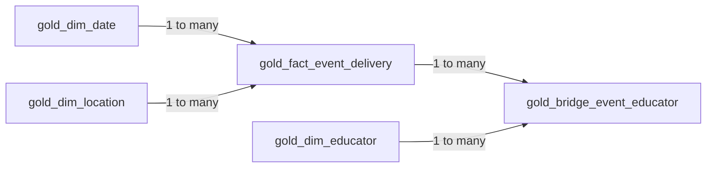

# Semantic Model Design

## Overview

The **Water Safety Analytics Model** is a Direct Lake semantic model built in Microsoft Fabric on top of five curated Gold Delta tables in `water_safety_lakehouse`.

It provides a reusable analytical layer for Power BI reporting and answers twelve business questions about community water-safety delivery, participation, attendance, outreach, venues, languages, satisfaction, and educator contribution.

The source data is synthetic and anonymised for portfolio demonstration purposes. Event names are based on real activity types, while participant, staffing, satisfaction, and operational values are simulated.

## Design objectives

The model was designed to:

- separate business-friendly dimensions from measurable delivery activity;
- preserve the distinction between event groups and individual delivery records;
- support multi-educator events without losing staffing detail;
- prevent accidental double counting across the event-educator relationship;
- provide reusable DAX measures that respond correctly to report filter context;
- expose consistent definitions for SQL validation and Power BI reporting;
- keep technical ingestion and transformation fields out of the report authoring experience.

## Model architecture



All four relationships are active and use **single-direction filtering**.


## Table design

### `gold_fact_event_delivery`

**Role:** Central fact table  
**Grain:** One row per event delivery (`event_id`)

This table contains the measurable operational result of each delivered activity, including:

- event and event-group identifiers;
- event date and location key;
- event type and programme type;
- audience, language, format, and demonstration attributes;
- registrations and attendance;
- estimated people reached;
- engagement and boat counts;
- satisfaction score;
- session duration;
- lead educator reference;
- delivery and data-quality metadata.

The model deliberately distinguishes:

```text
event_group_id = the overall activity or campaign
event_id       = one individual delivery record
```

For example, a four-day exhibition can represent one event group and four delivery records. This distinction supports both strategic event counts and operational delivery counts.

### `gold_dim_date`

**Role:** Date dimension  
**Grain:** One row per calendar date

The date dimension contains:

- `date_key`;
- calendar date;
- year and quarter;
- month number and month name;
- year-month label;
- week of year;
- day name and day of month.

Model configuration:

- the table is marked as the semantic model's date table;
- `date` is used as the date column;
- `month_name` is sorted by `month_number`;
- `year_month` is used for chronological trend analysis.

### `gold_dim_location`

**Role:** Location dimension  
**Grain:** One row per location (`location_id`)

The location dimension supports analysis by:

- region;
- suburb;
- venue name;
- raw venue type;
- standardised venue category;
- indoor/outdoor classification;
- water-access characteristics.

`venue_type` preserves the detailed source classification. `venue_category` provides the reporting-level business grouping. For example, `Church` and `Church Hall` are combined under the `Church` venue category without modifying the raw source data.

### `gold_dim_educator`

**Role:** Educator dimension  
**Grain:** One row per anonymised educator or ambassador (`educator_id`)

The educator dimension contains:

- anonymised educator name;
- experience level;
- primary and secondary languages;
- active status.

The model contains eight anonymised educators.

### `gold_bridge_event_educator`

**Role:** Event-educator bridge table  
**Grain:** One row per unique event-educator assignment

The bridge table resolves the many-to-many business relationship between event deliveries and educators. It contains:

- `event_id`;
- `educator_id`;
- educator role;
- hours worked;
- estimated-data indicator;
- Gold processing metadata.

One event may involve one educator, while a large event such as a boat show may involve five or six educators or ambassadors.

## Relationships

| One side | Many side | Cardinality | Filter direction | Status |
|---|---|---|---|---|
| `gold_dim_date[date_key]` | `gold_fact_event_delivery[event_date_key]` | One-to-many | Date → Fact | Active |
| `gold_dim_location[location_id]` | `gold_fact_event_delivery[location_id]` | One-to-many | Location → Fact | Active |
| `gold_fact_event_delivery[event_id]` | `gold_bridge_event_educator[event_id]` | One-to-many | Fact → Bridge | Active |
| `gold_dim_educator[educator_id]` | `gold_bridge_event_educator[educator_id]` | One-to-many | Educator → Bridge | Active |

### Why single-direction relationships are used

Single-direction relationships keep filter propagation predictable and reduce ambiguity:

```text
Date     ──► Fact ──► Bridge
Location ──► Fact ──► Bridge
Educator ───────────► Bridge
```

This design allows date and location filters to constrain event and staffing analysis, while educator filters operate directly on the assignment bridge.

The model does not rely on bidirectional filtering to force educator filters back into the event fact table. This prevents event-level values from being casually repeated across all assigned educators.

## Educator modelling decision

The fact table retains `lead_educator_id` as an event attribute, but it is not used as the main relationship for educator participation analysis.

A direct relationship from `gold_dim_educator` to `gold_fact_event_delivery[lead_educator_id]` would answer only:

> Who was recorded as the lead educator?

It would not answer:

> Which educators and ambassadors participated in the activity?

Participation analysis therefore uses:

```text
gold_dim_educator
        ↓
gold_bridge_event_educator
        ↑
gold_fact_event_delivery
```

`Events Delivered by Educator` is calculated with a distinct count of bridge-table `event_id` values.

### Preventing double counting

Event-level metrics such as `people_reached` belong to the event-delivery fact grain. They must not be summed directly across the bridge by educator.

If one event reached 200 people and involved six educators, assigning the full 200 to every educator would produce an incorrect combined total of 1,200.

The model therefore does not currently expose a `People Reached by Educator` measure. Such a measure would require an explicit attribution rule, for example:

- equal allocation across assigned educators;
- allocation based on recorded hours;
- lead-versus-support weighting;
- no additive total, with event reach shown only as contextual information.

## Measure design

The semantic model contains 15 measures organised into five display folders.

| Display folder | Measures | Analytical purpose |
|---|---:|---|
| `01 - Core KPIs` | 5 | Deliveries, event groups, reach, registrations, and attendance |
| `02 - Attendance` | 3 | Registration-applicable attendance, variance, and attendance rate |
| `03 - Satisfaction` | 2 | Average satisfaction and rating coverage |
| `04 - Educator` | 2 | Delivered events and educator hours |
| `05 - Time & Outreach` | 3 | Session hours, average reach, and locations served |

Complete formulas and definitions are documented in [`dax/measures.md`](../dax/measures.md).

## Metric definitions and analytical decisions

### Delivery records versus event groups

Two measures are intentionally maintained:

```text
Total Delivery Records = 47
Total Event Groups      = 34
```

`Total Delivery Records` measures operational delivery activity. `Total Event Groups` measures distinct events or campaigns. Neither should be substituted for the other without first confirming the business question.

### People reached

`Total People Reached` sums the Gold fact metric `people_reached` and returns an expected overall total of **3,565**.

The source value may be observed, estimated, or derived depending on the activity format. The synthetic portfolio dataset retains estimation indicators so this limitation remains visible.

### Attendance rate: ratio of totals

The overall attendance rate is calculated as:

```DAX
Attendance Rate =
DIVIDE (
    [Registered Event Attended],
    [Total Registered]
)
```

This is a **ratio of totals**, not an average of row-level attendance ratios.

The calculation also limits its numerator to event deliveries that contain registration data. This ensures that registered and attended values cover the same population.

Expected overall results:

```text
Total Registered          = 191
Registered Event Attended = 171
Attendance Variance       = -20
Attendance Rate           = 89.5%
```

Actual attendance may exceed registration for an individual activity. This is treated as a valid operational outcome rather than an automatic data-quality failure.

### Satisfaction

`Average Satisfaction` calculates the average score across rated event-delivery records. It ignores blank satisfaction values.

The measure is not participant weighted because the current dataset does not contain a reliable satisfaction response count. A participant-weighted result would require both a rating value and the number of responses contributing to that value.

`Rated Delivery Records` provides coverage context so that an average score is not interpreted without knowing how many delivery records supplied a rating.

### Session hours versus educator hours

The model separates:

```text
Total Session Hours = duration of delivered activities
Educator Hours      = combined staffing contribution
```

A two-hour activity with six educators contributes two session hours and potentially twelve educator hours.

## Business-question coverage

| # | Business question | Primary fields and measures |
|---:|---|---|
| 1 | How many community water-safety events have been delivered? | `Total Delivery Records`, `Total Event Groups` |
| 2 | How many participants have been reached? | `Total People Reached` |
| 3 | How have event delivery and participation changed over time? | `gold_dim_date[year_month]`, `Total Delivery Records`, `Total People Reached` |
| 4 | Which regions and suburbs have the highest and lowest participation? | `region`, `suburb`, `Total People Reached`, `Total Delivery Records` |
| 5 | How does actual attendance compare with registered attendance across event types? | `event_type`, `Total Registered`, `Registered Event Attended`, `Attendance Variance`, `Attendance Rate` |
| 6 | Which programme types reach the greatest number of participants? | `programme_type`, `Total People Reached`, `Average People Reached per Delivery` |
| 7 | Which languages are used for programme delivery? | `delivery_language`, `Total Delivery Records` |
| 8 | How does participation vary by delivery language? | `delivery_language`, `Total People Reached`, `Average People Reached per Delivery` |
| 9 | Which venue types are used most frequently? | `venue_category`, `Total Delivery Records`, `Total People Reached` |
| 10 | What is the average satisfaction score? | `Average Satisfaction`, `Rated Delivery Records` |
| 11 | Which educators delivered the most events? | `educator_name`, `Events Delivered by Educator`, `Educator Hours` |
| 12 | Which locations or communities may require additional outreach? | `region`, `suburb`, `Locations Reached`, `Total Delivery Records`, `Total People Reached` |

## Validation strategy

Semantic-model results are validated against SQL queries executed through the Lakehouse SQL analytics endpoint.

Validation covers:

- overall KPIs;
- month-by-month delivery and reach;
- region and suburb results;
- programme, language, and venue-category breakdowns;
- registration and attendance comparison;
- satisfaction by event type;
- educator delivery counts and hours.

Known control totals include:

| Metric | Expected result |
|---|---:|
| Delivery records | 47 |
| Event groups | 34 |
| People reached | 3,565 |
| Registered participants | 191 |
| Registered-event attendance | 171 |
| Attendance variance | -20 |
| Attendance rate | 89.5% |
| Distinct locations reached | 27 |
| Educators | 8 |

Reusable DAX validation queries are stored in `dax/semantic_model_validation.dax`.

## Report-view field management

Technical keys and processing metadata remain in the model because relationships, validation, and troubleshooting depend on them. They should be hidden from report authors where appropriate, rather than deleted.

Typical fields to hide in report view include:

- surrogate and relationship keys such as `date_key` and `event_date_key`;
- technical IDs when a friendly label is available;
- `gold_processed_timestamp`;
- ingestion or estimation metadata that is not intended for a report page;
- row-level helper columns that have been replaced by approved measures.

Business-facing attributes and all approved measures remain visible.

## Current limitations

- The dataset is synthetic and should not be interpreted as an official organisational performance record.
- Satisfaction is measured at event-delivery level and is not participant weighted.
- People reached cannot currently be attributed additively to individual educators.
- Outreach need is inferred from delivery frequency and participant reach; it does not include external population, demographic, incident, or risk data.
- The current model covers a limited 2026 portfolio period, so year-over-year analysis is not yet meaningful.

## Next step

The next phase is to build a Power BI report using this semantic model. Planned report pages are:

1. Executive Overview
2. Attendance and Engagement
3. Outreach and Locations
4. Programmes, Languages, and Venues
5. Educator Contribution

Visual totals will be reconciled with the existing SQL and DAX validation queries before the report is published.

